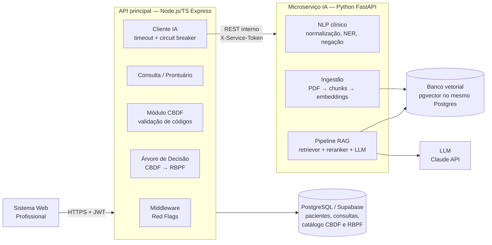
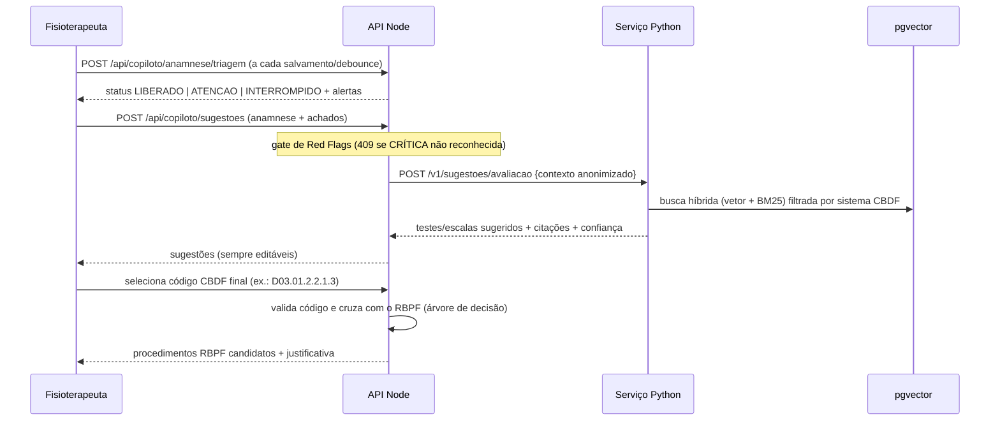

# Arquitetura — Copiloto Clínico de Fisioterapia

> O copiloto **apoia** o raciocínio clínico; ele **não decide**. Toda sugestão é rastreável
> (fonte + versão) e o diagnóstico CBDF final é sempre selecionado pelo fisioterapeuta.

## 1. Visão geral



### Responsabilidades

| Componente | Responsabilidade | Por que aqui |
|---|---|---|
| **API Node/TS** (já existe) | Autenticação, prontuário, regras determinísticas (Red Flags, validação CBDF, árvore CBDF→RBPF), auditoria, orquestração | Regras clínicas de segurança precisam ser **determinísticas, testáveis e rápidas**, sem depender de LLM |
| **Microserviço Python** | NLP, embeddings, RAG, geração de sugestões com citação | Ecossistema de IA (FastAPI, sentence-transformers, LangChain/LlamaIndex) |
| **pgvector** | Chunks da CBDF, diretrizes e literatura com embeddings | Já temos Postgres no Supabase: um banco a menos para operar, com suporte a transação e filtro por metadados |
| **Postgres relacional** | Catálogo CBDF (códigos e qualificadores) e RBPF (procedimentos), em tabelas | A árvore de decisão consulta dados **estruturados**, não o banco vetorial |

## 2. Fluxo de uma consulta



A ordem segue o fluxo da CBDF: **anamnese (HFA/HFP) → exame físico-funcional → diagnóstico → prognóstico/objetivos → intervenção (RBPF)**. O RAG atua entre a anamnese e o exame (sugere *o que avaliar*). A árvore de decisão atua depois do diagnóstico (sugere *o que o RBPF oferece*).

## 3. Contrato API ⇄ Python

- **Transporte:** REST/JSON interno (`http://ia-service:8000`), versionado (`/v1`). A rede é privada e a autenticação é feita com `X-Service-Token` (segredo compartilhado; migrar para mTLS em produção).
- **Resiliência no Node:** timeout de 8 s, 1 retry com backoff e circuit breaker. Se a IA cair, o sistema **continua funcionando** sem sugestões (degradação graciosa).
- **Privacidade (LGPD):** o Node envia apenas o contexto clínico **pseudonimizado**, sem nome, CPF ou contato. O `consultaId` é trocado por um UUID de correlação.
- **Rastreabilidade:** toda resposta traz `fonte`, `trecho`, `versaoBase` e `modelo`, que são gravados em uma tabela de auditoria junto com o que o profissional aceitou ou rejeitou.

```jsonc
// POST /v1/sugestoes/avaliacao
{
  "correlationId": "7f1c…",
  "anamnese": { "queixaPrincipal": "…", "hfa": "…", "hfp": "…" },
  "sistemasSuspeitos": ["D03"],        // opcional, vindo da UI
  "redFlags": ["INF_FEBRE_DOR"],        // o RAG considera, mas não reavalia
  "topK": 5
}
// 200
{
  "sugestoes": [
    {
      "tipo": "ESCALA",                  // ESCALA | TESTE_FISICO | QUESTIONARIO
      "nome": "Escala Numérica da Dor (END)",
      "caracterizadorCbdf": "Bloco B — 3º subcódigo (Dor, b280)",
      "comoQualificar": "0-10 → CIF: 0=0 | 1-2=1 | 3-5=2 | 6-9=3 | 10=4",
      "justificativa": "…",
      "citacoes": [{ "fonte": "CBDF Anexo 1", "pagina": 9, "trecho": "…" }],
      "confianca": 0.82
    }
  ],
  "modelo": "claude-sonnet-5",
  "versaoBase": "cbdf-2026.09"
}
```

## 4. Banco vetorial (pgvector)

```sql
create extension if not exists vector;
create table conhecimento_chunk (
  id           bigserial primary key,
  fonte        text not null,          -- 'CBDF_ANEXO1', 'RBPF', 'DIRETRIZ_X'
  versao       text not null,
  sistema_cbdf text,                   -- 'D03', 'S04'... filtro por metadado
  bloco        text,                   -- 'A' | 'B' | 'C'
  pagina       int,
  conteudo     text not null,
  embedding    vector(1024) not null
);
create index on conhecimento_chunk using hnsw (embedding vector_cosine_ops);
```

A ingestão é feita por chunking **semântico por seção**, respeitando a estrutura do documento: cada tabela de caracterizador (ex.: "Força b7308, 0–4, 8, 9") vira **um** chunk, para não quebrar a escala no meio. A busca é híbrida (vetor + full-text em português) e a filtragem usa `sistema_cbdf`.

## 5. Modelo CBDF no código (para a árvore de decisão)

Formato: `{S|D}{sistema 2d}.{status 2d}.{q3}.{q4}.{q5}.{q6}`, por exemplo `D01.01.8.3.9.4`.

- Qualificadores numéricos: `0–4`, `8` (não especificada) e `9` (não aplicável). Para instrumentos categóricos, apenas `0` ou `4`.
- **Blocos por sistema:**
  - D01, D02, D03 e D06: Bloco B = q3–q5; Bloco C = q6 (segmento corporal).
  - D04, D05, D07, D08 e D09: Bloco B = q3–q6.
  - D10: Bloco B = q3; Bloco C = q4–q6 (massa corporal, gordura e massa muscular).
- **Condição S** (saúde, sem alteração): q2 é `00` (sem risco) ou `01` (com risco). Com `00`, q3–q6 = 0 (e 9 no segmento). Com `01`, pelo menos um qualificador deve ser 1.
- **Busca no Anexo 2:** trocar os dígitos 8/9 por 0 para achar o *código-base*, sem substituir o código diagnosticado.

A **árvore de decisão** (próxima tarefa) usará tabelas `cbdf_codigo` e `rbpf_procedimento` com uma tabela de ligação `cbdf_rbpf_regra (sistema, status, faixa_qualificador, procedimento_id, evidencia)`. Como a própria CBDF lembra, ela **classifica e não prescreve**. Por isso, a árvore apenas **lista procedimentos candidatos do RBPF** e a escolha final fica com o profissional.

## 6. Middleware de Red Flags (implementado)

| Arquivo | Papel |
|---|---|
| `backend/src/copiloto/redFlags/types.ts` | Contratos (entrada, alerta, resultado) |
| `backend/src/copiloto/redFlags/regras.ts` | Catálogo versionado: regras de texto (regex) e de contexto (sinais vitais, idade, comorbidades) |
| `backend/src/copiloto/redFlags/redFlagEngine.ts` | Normalização (sem acento), detecção de **negação** (NegEx simplificado), severidade e status |
| `backend/src/middleware/redFlags.ts` | Middleware Express com modos `gate` (bloqueia com 409) e `anotar` |
| `backend/src/routes/copiloto.ts` | `POST /api/copiloto/anamnese/triagem` e `POST /api/copiloto/sugestoes` (gate) |

**Status retornado:**
- `LIBERADO`: nenhum alerta.
- `ATENCAO`: alertas ALTA ou MODERADA; o fluxo segue com os alertas visíveis.
- `INTERROMPIDO`: pelo menos um alerta CRÍTICO; as sugestões ficam suspensas até o profissional reenviar a requisição com `X-RedFlags-Reconhecido: true`, e esse reconhecimento deve ser auditado.

**Por que regras determinísticas, e não LLM, para red flags?** Porque o sistema precisa de latência baixa (validação em tempo real), resultado previsível e auditável, e nenhum risco de "alucinação" em um alerta de segurança. Numa fase futura, o NLP em Python pode *complementar* essas regras (sinônimos, erros de digitação), mas sem substituí-las.

> ⚠️ O catálogo de regras é um ponto de partida técnico e **precisa de validação clínica** por fisioterapeutas antes do uso real.
